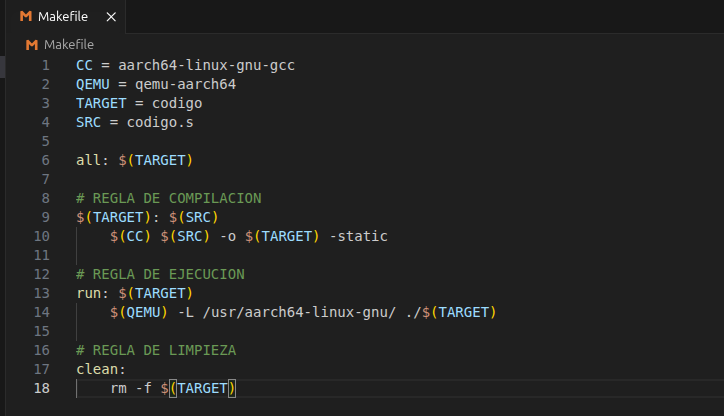
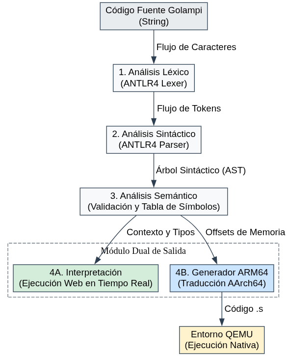

# DIAGRAMA DE CLASES Y FLUJO DE PROCESAMIENTO

La arquitectura de GOLAMPI se basa en un diseño híbrido de una sola pasada (*One-Pass*), donde convergen las características de un **Intérprete en tiempo real** (Tree-Walk Interpreter) y un **Compilador AOT** (Ahead-of-Time) dirigido a la arquitectura ARM64. El flujo de procesamiento se divide en las siguientes fases:

## 1. ANÁLISIS LÉXICO
El análisis léxico constituye la primera fase del pipeline de compilación. Utilizando el analizador léxico (*Lexer*) generado automáticamente por ANTLR4 a partir de la gramática formal, el código fuente entrante (secuencia de caracteres) es tokenizado. En esta etapa se descartan elementos no significativos (como espacios en blanco y comentarios) y se agrupan los caracteres en unidades con significado léxico llamadas **tokens**. Ante caracteres desconocidos, el sistema emplea técnicas de recuperación léxica (*character skipping*) para asegurar que el flujo de tokens no se interrumpa abruptamente.

## 2. ANÁLISIS SINTÁCTICO
Durante esta fase, el analizador sintáctico (*Parser* de ANTLR4) consume el flujo de tokens para validar que la secuencia cumpla estrictamente con las reglas de producción de la gramática de Golampi. El resultado principal de este proceso es la construcción en memoria de un **Árbol de Análisis Sintáctico (*Parse Tree*)**. El sistema implementa rutinas de recuperación de errores (*Panic Mode* y *Single-Token Insertion/Deletion*), garantizando la generación de un árbol estructuralmente estable para las fases posteriores, sin necesidad de construir manualmente un AST (*Abstract Syntax Tree*).

## 3. ANÁLISIS SEMÁNTICO Y TABLA DE SÍMBOLOS
Esta etapa dota de significado a la estructura sintáctica mediante la aplicación del patrón de diseño *Visitor* sobre el árbol generado. A medida que se recorren los nodos, se construye y gestiona dinámicamente la **Tabla de Símbolos**, implementada como una pila de entornos (*Environment Stack*) para el control estricto de ámbitos (*Scope* global y local). 
En esta fase se realizan validaciones críticas:
*   Verificación de tipos de datos estáticos y dinámicos.
*   Resolución de firmas de funciones (parámetros y retornos).
*   Validación de declaraciones y asignaciones previas.
Ante violaciones semánticas, se aplica el patrón de recuperación *Poison Pill* (inyectando valores seguros/nulos) para reportar todos los errores en cascada sin abortar el recorrido del árbol.

## 4. INTERPRETACIÓN EN TIEMPO REAL
Actuando de manera simultánea con la validación semántica, el motor interno funciona como un intérprete que recorre el árbol (*Tree-Walk Interpreter*). A través del módulo `Interpreter`, los nodos son evaluados secuencialmente, resolviendo expresiones matemáticas, gestionando el flujo de control condicional/iterativo y manipulando los valores reales en la Tabla de Símbolos. Esto proporciona ejecución en vivo y retroalimentación inmediata en la consola de la interfaz web, aislando la lógica en un entorno de pruebas interactivo.

## 5. GENERACIÓN DE CÓDIGO (TRADUCCIÓN ARM64)
Paralelamente al intérprete, el módulo de traducción (`Arm64Generator`) actúa como el **consumidor principal** de la Tabla de Símbolos. Utilizando la información semántica recolectada (como los tipos de datos y los ámbitos), el generador calcula matemáticamente la alineación y los desplazamientos de memoria (*offsets* relativos al *Frame Pointer* `x29`) para variables locales y globales. Con base en esta planimetría de memoria, el Visitor emite instrucciones nativas en lenguaje ensamblador AArch64 (arquitectura ARM de 64 bits), gestionando registros de propósito general (x0-x30) y registros de punto flotante de la FPU (s0-s31). El resultado es un código objeto robusto (secciones `.text` y `.data`), listo para ser enlazado y ejecutado en hardware físico o entornos emulados como QEMU.

## 6. EJECUCION DEL CODIGO
1. **Ensamblaje y Enlazado (`make`):**
   Se invoca al compilador cruzado `aarch64-linux-gnu-gcc` actuando como ensamblador y enlazador. La bandera `-static` es crítica: fuerza al enlazador a incrustar todas las dependencias de la biblioteca estándar de C (como las llamadas requeridas por `fmt.Println`) directamente dentro del binario ejecutable, eliminando la dependencia de bibliotecas compartidas (`.so`).

2. **Emulación y Ejecución (`make run`):**
   El binario ARM64 se ejecuta utilizando `qemu-aarch64`, un emulador de espacio de usuario. La directiva `-L /usr/aarch64-linux-gnu/` establece la ruta del *sysroot*, indicándole al emulador dónde localizar las estructuras base del sistema embebido, permitiendo que el programa interactúe con las llamadas al sistema operativo (*Syscalls*) correctamente.

3. **Mantenimiento (`make clean`):**
   Limpia el entorno eliminando el binario precompilado (`codigo`), asegurando que compilaciones subsecuentes utilicen siempre el código fuente más reciente generado por el sistema web.

4. **Archivo Makefile:**

---

## FLUJO DE PROCESAMIENTO
.png>)

## DIAGRAMA DE CLASES

# 1. Gramática Formal de Golampi

La gramática de Golampi está diseñada para ser procesada por ANTLR4, definiendo una sintaxis fuertemente tipada con soporte para operaciones aritméticas, lógicas, estructuras de control, punteros y funciones.

## SÍMBOLO INICIAL Y ESTRUCTURA

< programa > ::= < topLevel >* EOF

< topLevel > ::= < funcion > 
               | < mainFuncion > 
               | < declaracion > 
               | < declaracionConst >

< mainFuncion > ::= "func" "main" "(" ")" < bloque >

< bloque > ::= "{" ( < i > ";"? )* "}"

## INSTRUCCIONES

< i > ::= < imprimir > 
        | < declaracion > 
        | < declaracionCorta > 
        | < declaracionConst > 
        | < asignacion > 
        | < sentenciaIf > 
        | < sentenciaSwitch > 
        | < sentenciaFor > 
        | < expFor > 
        | < funcion > 
        | < retornar > 
        | < llamadaFuncion > 
        | < logExpr > 
        | "continue" 
        | "break"

## DECLARACIONES Y ASIGNACIONES

< declaracion > ::= "var" < listaId > < tipos > 
                  | "var" < listaId > < tipos > "=" < listaExpr >

< declaracionCorta > ::= < listaId > ":=" < listaExpr >

< declaracionConst > ::= "const" < IDENTIFICADOR > < tipos > "=" < logExpr >

< asignacion > ::= < lValue > < simboloAsignacion > < logExpr >

< lValue > ::= < IDENTIFICADOR > 
             | < factor > "[" < logExpr > "]" 
             | "*" < factor >

< simboloAsignacion > ::= "=" | "+=" | "-=" | "*=" | "/="

## ESTRUCTURAS DE CONTROL

### Sentencia IF
< sentenciaIf > ::= "if" < logExpr > < bloque > ( "else" < bloque > )?

### Sentencia SWITCH
< sentenciaSwitch > ::= "switch" < logExpr > "{" < bloqueSwitch > "}"
< bloqueSwitch > ::= ( < bloqueCase > )+ ( < bloqueDefault > )?
< bloqueCase > ::= "case" < listaExpr > ":" ( < i > )*
< bloqueDefault > ::= "default" ":" ( < i > )*

### Sentencia FOR
< sentenciaFor > ::= "for" < forClasico > 
                   | "for" < logExpr > < bloque > 
                   | "for" < bloque >

< forClasico > ::= < declaracionCorta > ";" < logExpr > ";" < condFor > < bloque >
< condFor > ::= < expFor > | < asignacion >
< expFor > ::= < IDENTIFICADOR > "++" | < IDENTIFICADOR > "--"

## FUNCIONES

< funcion > ::= "func" < IDENTIFICADOR > "(" < listaParametros >? ")" "(" < listaRetorno > ")" < bloque >
              | "func" < IDENTIFICADOR > "(" < listaParametros >? ")" < tipos > < bloque >
              | "func" < IDENTIFICADOR > "(" < listaParametros >? ")" < bloque >

< listaRetorno > ::= < tipos > ( "," < tipos > )*
< listaParametros > ::= < parametro > ( "," < parametro > )*
< parametro > ::= < IDENTIFICADOR > "*"? < tipos >

< llamadaFuncion > ::= < IDENTIFICADOR > "(" < listaExpr >? ")"
< retornar > ::= "return" < listaExpr >?
< argumento > ::= "&"? < logExpr >

## FUNCIONES EMBEBIDAS

< imprimir > ::= "fmt" "." "Println" "(" < listaExpr > ")"
< funcLen > ::= "len" "(" < logExpr > ")"
< funcNow > ::= "now" "(" ")"
< funcSub > ::= "substr" "(" < logExpr > "," < logExpr > "," < logExpr > ")"
< funcType > ::= "typeOf" "(" < logExpr > ")"

## EXPRESIONES Y OPERADORES

< logExpr > ::= < logExpr > ("&&" | "||") < relExpr > | < relExpr >
< relExpr > ::= < relExpr > ("<=" | ">=" | "==" | "!=" | "<" | ">") < expr > | < expr >
< expr > ::= < expr > ("+" | "-") < term > | < term >
< term > ::= < term > ("*" | "/" | "%") < factor > | < factor >

< factor > ::= < factor > "[" < logExpr > "]" 
             | "(" < logExpr > ")" 
             | ("-" | "!" | "*" | "&") < factor > 
             | < literal > 
             | < funcNow > 
             | < funcLen > 
             | < funcSub > 
             | < funcType > 
             | < llamadaFuncion > 
             | < IDENTIFICADOR >

## LITERALES Y ARREGLOS

< literal > ::= < arrayLiteral > | < FLOAT > | < ENTERO > | < BOOL > | < RUNE > | < STR > | < NIL >

< arrayLiteral > ::= < tipos > "{" < listaElementos >? "}"
< listaElementos > ::= < elemento > ( "," < elemento > )*
< elemento > ::= < logExpr > | "{" < listaElementos > "}"

## LISTAS COMPARTIDAS

< listaExpr > ::= < argumento > ( "," < argumento > )*
< listaId > ::= < IDENTIFICADOR > ( "," < IDENTIFICADOR > )*

## TIPOS DE DATOS

< tipos > ::= "[" < logExpr > "]" < tipos > | < tipoBase >
< tipoBase > ::= "int" | "int32" | "float" | "float32" | "bool" | "rune" | "string"