# MANUAL DE USUARIO

## 1. REQUISITOS E INSTALACIÓN

Para utilizar GOLAMPI en su totalidad (Intérprete Web y Compilador ARM64), es necesario contar con el siguiente entorno preparado:

### 1.1 Requisitos Previos
*   **Servidor Web con PHP:** PHP 8.0 o superior instalado.
*   **Composer:** Gestor de dependencias de PHP (para cargar las librerías de ANTLR4).
*   **Entorno Linux (Nativo o WSL):** Necesario para compilar y emular la salida de AArch64.
*   **Toolchain ARM64:** Paquetes `gcc-aarch64-linux-gnu` y `qemu-user`.

### 1.2 Pasos de Instalación
1.  **Clonar/Descargar el proyecto:** Coloca la carpeta del proyecto GOLAMPI en tu entorno local.
2.  **Instalar dependencias:** Abre una terminal en la raíz del proyecto y ejecuta el comando:
    `composer install` (Esto descargará la librería *runtime* de ANTLR4 en la carpeta `/vendor`).
3.  **Iniciar el servidor web:** Puedes usar un software como XAMPP o levantar el servidor integrado de PHP ejecutando en la consola:
    `php -S localhost:8000`
4.  **Acceder a la herramienta:** Abre tu navegador web favorito e ingresa a la dirección `http://localhost:8000`.

---

## 2. INTERFAZ PRINCIPAL

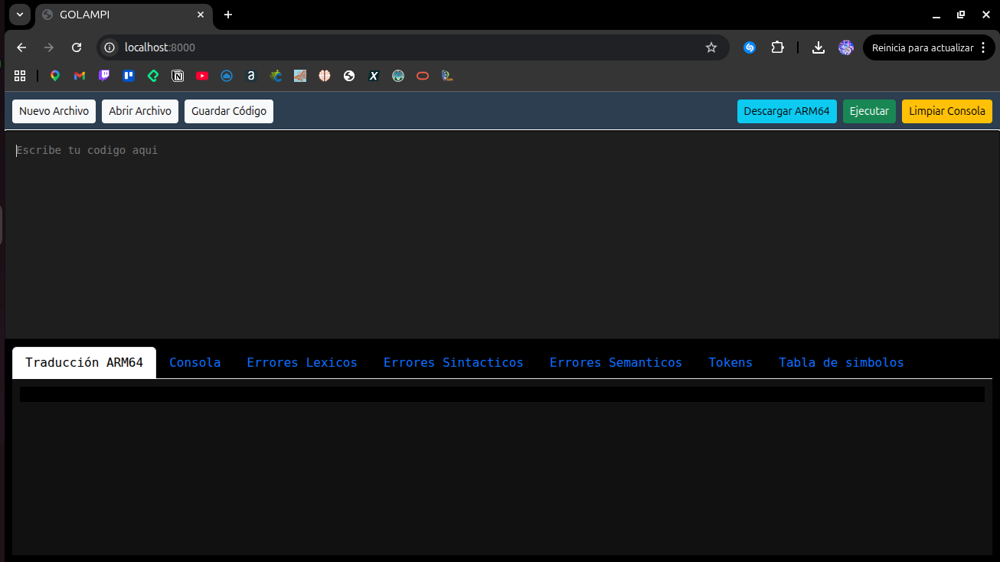

La interfaz está dividida en tres áreas de trabajo principales para facilitar la escritura y análisis del código:

### 2.1 Cinta de Opciones
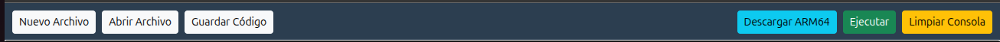
Ubicada en la parte superior. Aquí se encuentran todas las acciones de gestión de archivos y ejecución del compilador.

### 2.2 Editor de Texto
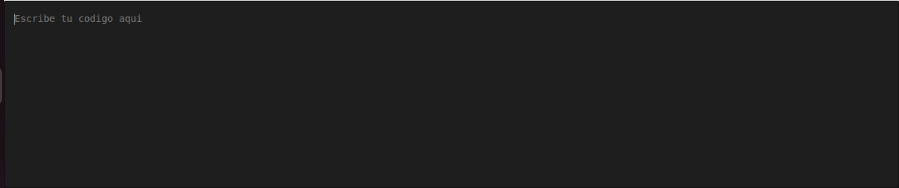
Ubicado en la parte superior. Es el área de trabajo donde escribiremos nuestro código fuente en lenguaje Golampi.

### 2.3 Panel de Análisis y Consola
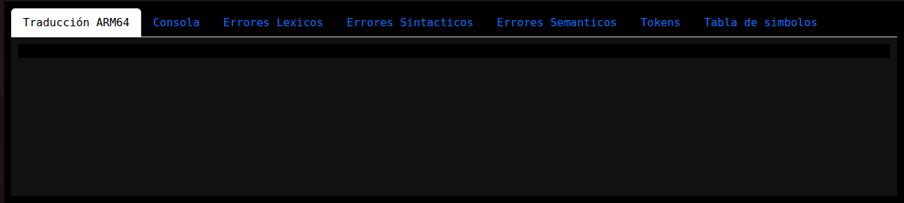
Ubicado en la parte inferior. Aquí se mostrará el resultado de la ejecución de nuestro código. Cuenta con varias pestañas navegables en las cuales se muestra información detallada del proceso de compilación e interpretación.

---

## 3. FUNCIONES DE LA HERRAMIENTA

En la cinta de opciones superior, contamos con los siguientes controles:

*   **Nuevo Archivo:** Al hacer clic en este botón, se limpiará el entorno de trabajo (borrando el contenido del editor y la consola) para comenzar a escribir desde cero.
*   **Abrir Archivo:** Abre un cuadro de diálogo que permite cargar un archivo local con extensión `.txt` directamente en el editor.
*   **Guardar Código:** Descarga un archivo `.txt` que contiene el código fuente que actualmente se encuentra escrito en el editor.
*   **Descargar ARM64:** Descarga el código ensamblador traducido (`codigo.s`) listo para ser compilado en un entorno AArch64.
*   **Ejecutar:** Inicia el análisis léxico, sintáctico, semántico y realiza la interpretación y traducción del código.
*   **Limpiar Consola:** Borra únicamente el contenido de las salidas (Consola y Traducción ARM64) para una nueva ejecución más limpia del código actual.

---

## 4. INTERPRETACIÓN DE REPORTES

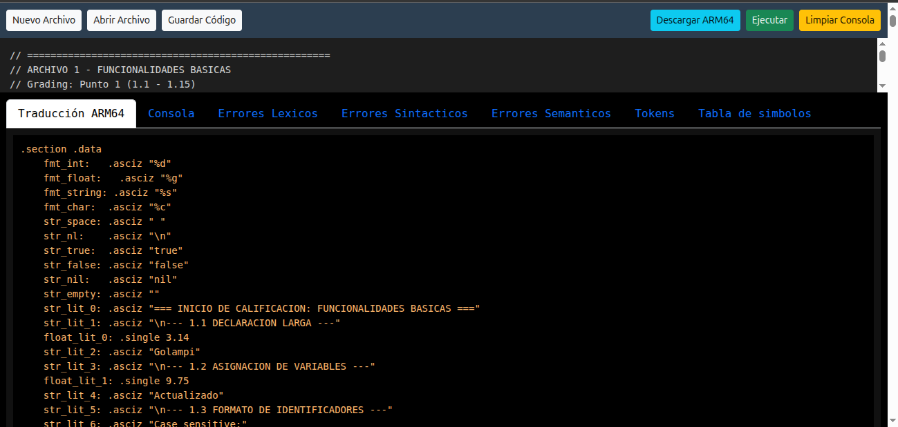

Una vez escrito el código en el editor, presionamos el botón **Ejecutar**. Si el proceso finaliza, el panel inferior se poblará de datos técnicos divididos en las siguientes pestañas:

*   **Traducción ARM64:** Muestra el código ensamblador nativo generado a partir del código fuente. Este es el código que el sistema guardará al usar el botón "Descargar ARM64".
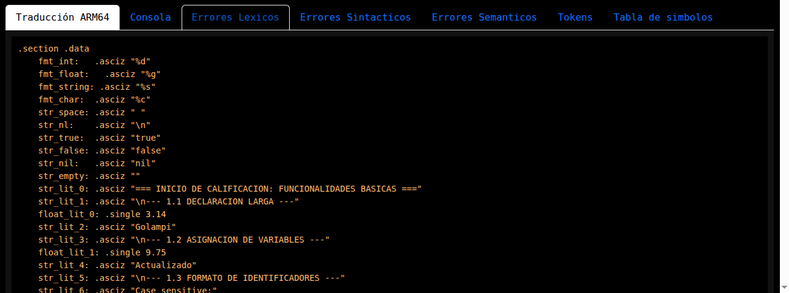

*   **Consola:** Aquí se muestra la salida estándar de la interpretación en tiempo real (ej. resultados de sentencias `fmt.Println`).
    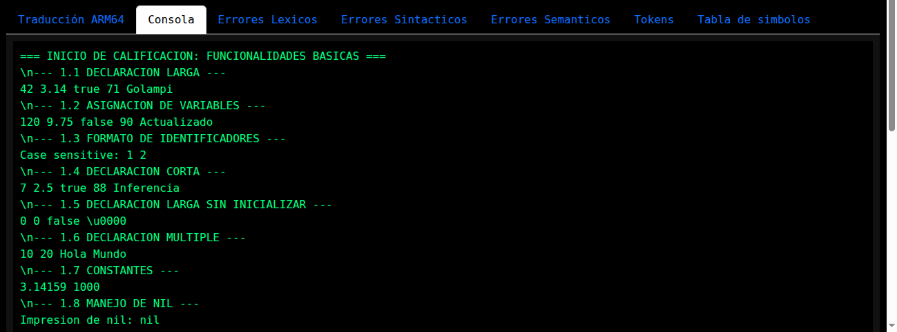

*   **Errores Léxicos:** Muestra caracteres o símbolos que el sistema no reconoce como válidos dentro del lenguaje Golampi. Indica el lexema conflictivo, la línea y la columna.
    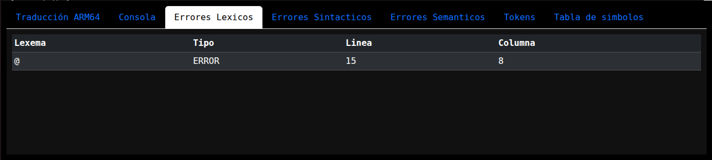

*   **Errores Sintácticos:** Reporta estructuras mal escritas que no coinciden con la gramática. Muestra el token problemático, la línea, la columna y un mensaje sobre qué símbolo se esperaba.
    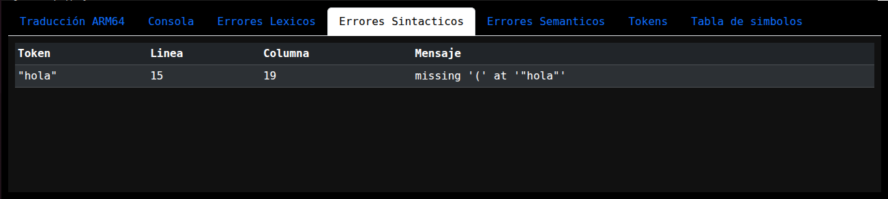

*   **Errores Semánticos:** Detalla problemas de lógica de programación atrapados por el compilador, tales como variables no declaradas, incompatibilidad de tipos, o llamadas a funciones incorrectas, especificando la línea exacta.
    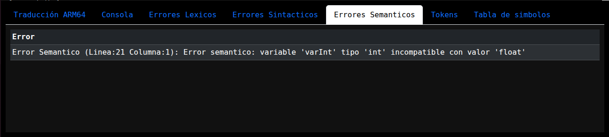

*   **Tokens:** Lista secuencial de todos los elementos léxicos reconocidos durante el escaneo del código, detallando su Lexema (texto), Tipo (ID de la regla léxica), línea y columna.
    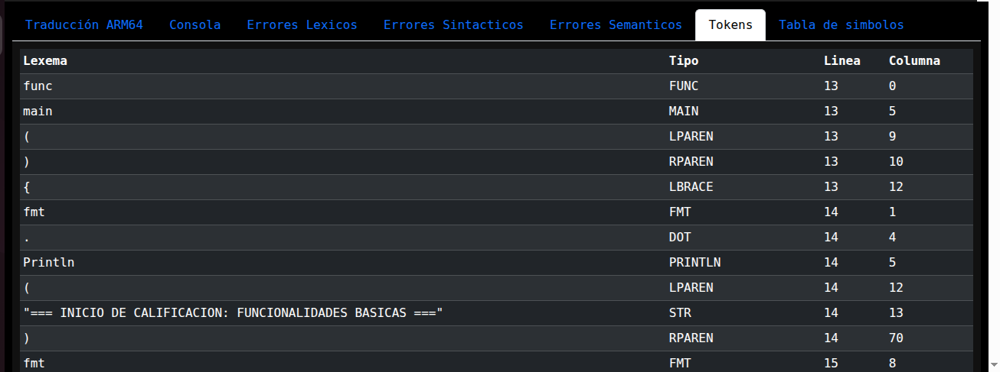

*   **Tabla de Símbolos:** Permite observar la memoria del compilador. Muestra todas las variables y funciones definidas, con su nombre, valor en tiempo real, tipo de dato, parámetros (si es función), línea, columna y el ámbito (*Scope* global o local) al que pertenecen.
    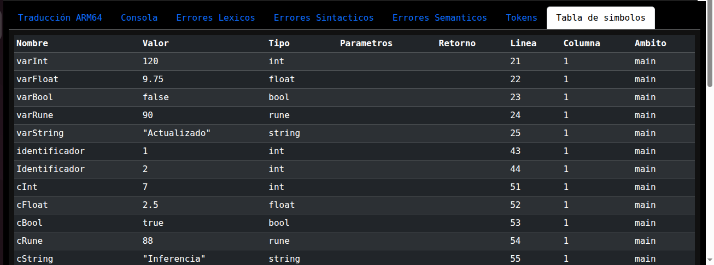

---

## 5. EJECUCIÓN FÍSICA Y EMULACIÓN (ARM64)

GOLAMPI no solo interpreta código en la web, sino que produce ejecutables reales. Sigue este procedimiento para ejecutar tu programa a bajo nivel:

1.  **Descargar el Ensamblador:** Tras presionar "Ejecutar" en la web, haz clic en **Descargar ARM64**. Se descargará un archivo llamado `codigo.s`.
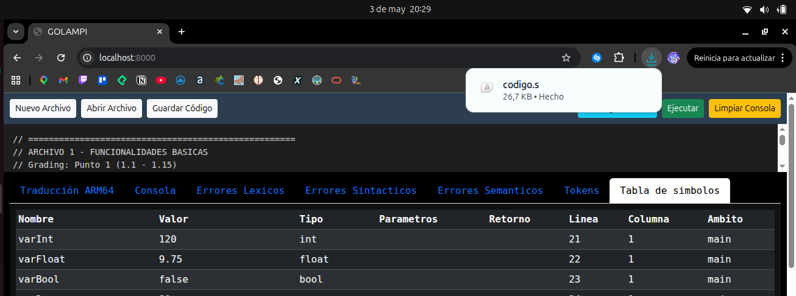
2.  **Preparar el entorno:** Coloca el archivo `codigo.s` en la misma carpeta donde tengas el archivo `Makefile` provisto por la herramienta.
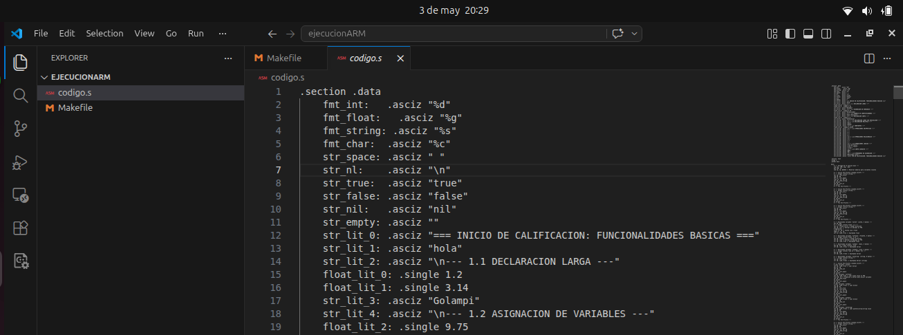
3.  **Ensamblar:** Abre la terminal de Linux en esa carpeta y ejecuta:
    `make`
    *(Esto generará un binario estático llamado `codigo`)*.
    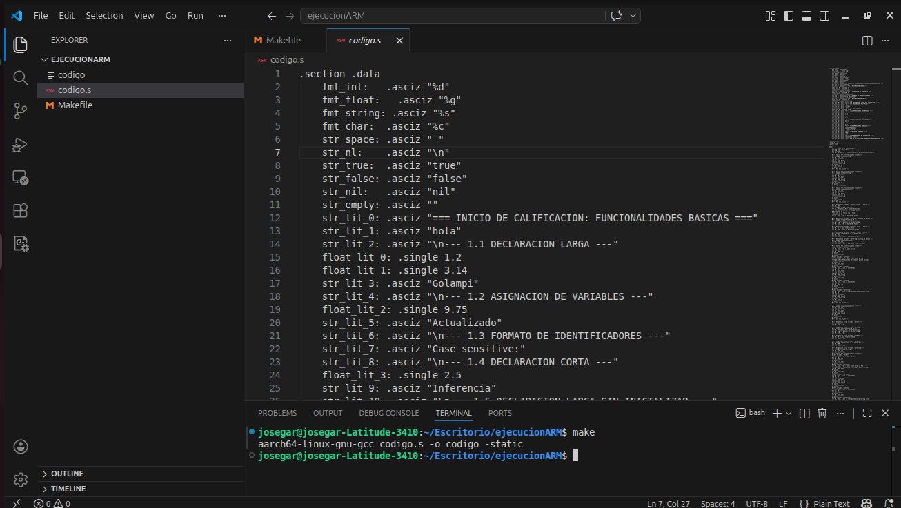
4.  **Ejecutar en el Emulador:** En la misma terminal, ejecuta:
    `make run`
5.  **Ver el resultado:** El programa se ejecutará a través de QEMU y mostrará los resultados directamente en tu terminal. Para limpiar los binarios, ejecuta `make clean`.
    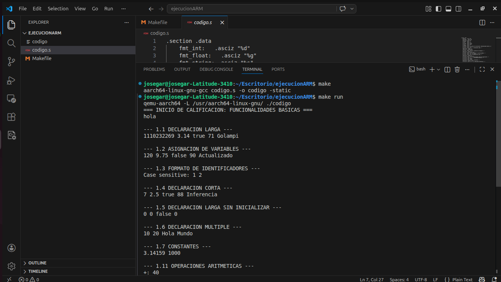
---

## 6. EJEMPLO DE SESIÓN DE USO (PASO A PASO)

**Paso 1: Creación del código**
Escribimos un programa sencillo en Golampi que calcule una operación y la imprima.
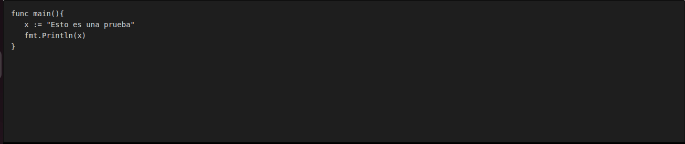

**Paso 2: Ejecución Web**
Hacemos clic en el botón verde "Ejecutar". Verificamos en la pestaña "Consola" que el resultado impreso es correcto.
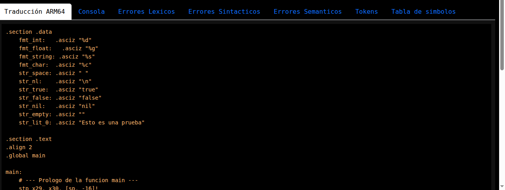

**Paso 3: Verificación de Tablas**
Revisamos la "Tabla de Símbolos" para confirmar que la variable `x` fue guardada en memoria como tipo `int` con el valor correcto.
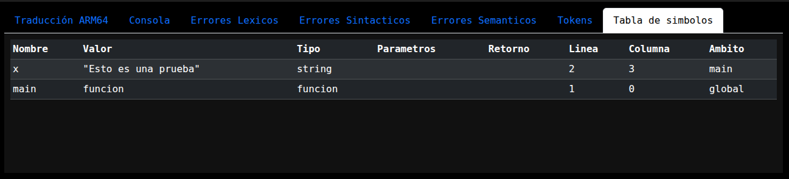

**Paso 4: Exportación y Ejecución a Bajo Nivel**
Hacemos clic en "Descargar ARM64", guardamos el archivo en nuestra carpeta local de Linux y ejecutamos `make run` en la terminal para obtener el resultado nativo.
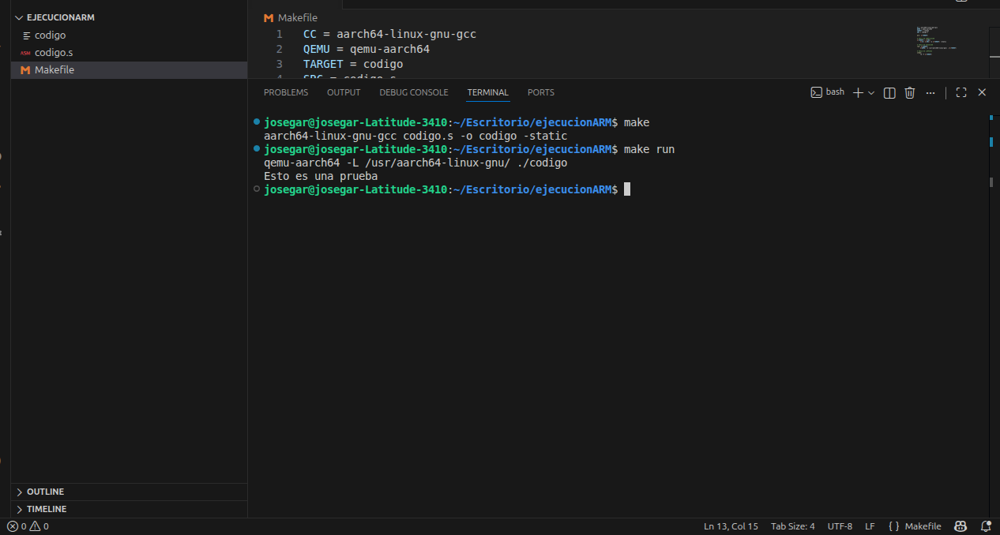